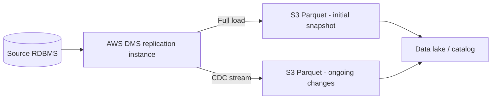

# Stream CDC into an S3 Data Lake in Parquet with AWS DMS
{: .no_toc }

*Part 8: Hands-on Tutorials &middot; Hands-on Tutorials*

**Read the full tutorial:** [Stream CDC into an S3 Data Lake in Parquet with AWS DMS](https://aws.amazon.com/blogs/big-data/stream-cdc-into-an-amazon-s3-data-lake-in-parquet-format-with-aws-dms/) &#8599;

*Link verified 2026-08-23.*

This tutorial points **AWS DMS** at a source relational database, replicating both a full initial load and every subsequent insert/update/delete as **change data capture** events, and lands each as Parquet files in S3.

It's the concrete, single-source version of the ingestion decision covered in [Ingestion Decisions: Batch, Incremental Loading & Change Data Capture](../06-ingestion-and-streaming-decisions/01-ingestion-decisions-batch-incremental-cdc/) — DMS here plays the role of the log-based CDC connector that topic argues for over trigger- or query-based polling.

<!-- prevnext:start -->

---

| [&larr; Previous: Serverless Data Lake Analytics with AWS Glue, S3 & Athena](01-serverless-data-lake-glue-athena/) | [Next: Transactional Data Lake with Apache Iceberg, EMR Serverless & Athena &rarr;](03-transactional-lake-iceberg-glue-athena/) |
|:---|---:|

<!-- prevnext:end -->
