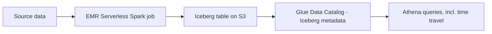

# Transactional Data Lake with Apache Iceberg, EMR Serverless & Athena
{: .no_toc }

*Part 8: Hands-on Tutorials &middot; Hands-on Tutorials*

**Read the full tutorial:** [Transactional Data Lake with Apache Iceberg, EMR Serverless & Athena](https://aws.amazon.com/blogs/big-data/build-a-serverless-transactional-data-lake-with-apache-iceberg-amazon-emr-serverless-and-amazon-athena/) &#8599;

*Link verified 2026-08-23.*

This tutorial adds **Apache Iceberg** as the table format over an S3 lake, using **EMR Serverless** Spark jobs to write ACID-compliant inserts, updates, and deletes, then querying the same tables from **Athena** with schema evolution and time travel.

It's the hands-on version of [Table Formats: Delta vs Iceberg vs Hudi](../04-storage-and-table-formats/02-table-formats-delta-iceberg-hudi/), showing what that comparison's abstract promises — ACID on object storage, safe schema change — look like as actual Iceberg table DDL and Spark write paths.

<!-- prevnext:start -->

---

| [&larr; Previous: Stream CDC into an S3 Data Lake in Parquet with AWS DMS](02-cdc-pipelines-dms-redshift/) | [Next: Build Your Apache Hudi Data Lake on Amazon EMR &rarr;](04-lakehouse-hudi-emr/) |
|:---|---:|

<!-- prevnext:end -->
