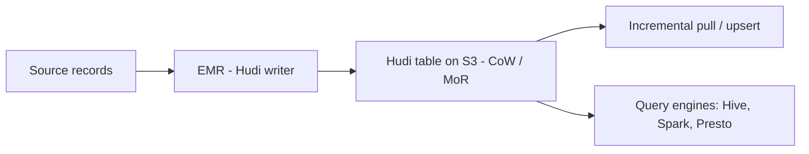

# Build Your Apache Hudi Data Lake on Amazon EMR
{: .no_toc }

*Part 8: Hands-on Tutorials &middot; Hands-on Tutorials*

**Read the full tutorial:** [Build Your Apache Hudi Data Lake on Amazon EMR](https://aws.amazon.com/blogs/big-data/part-1-build-your-apache-hudi-data-lake-on-aws-using-amazon-emr/) &#8599;

*Link verified 2026-08-23.*

This tutorial builds a **Hudi** table on an EMR cluster, then runs upserts and incremental pulls to show how Hudi tracks row-level changes instead of rewriting whole partitions on every update.

It puts [Table Formats: Delta vs Iceberg vs Hudi](../04-storage-and-table-formats/02-table-formats-delta-iceberg-hudi/) and the merged-storage promise of [Lakehouse Architecture: Unifying Warehouse & Lake](../02-architecture-patterns-deep-dive/03-lakehouse-architecture/) into practice — one open table format serving both the bulk-rewrite and the incremental-read use case a warehouse-only or lake-only design would need two systems for.

<!-- prevnext:start -->

---

| [&larr; Previous: Transactional Data Lake with Apache Iceberg, EMR Serverless & Athena](03-transactional-lake-iceberg-glue-athena/) | [Next: Manage Data Transformations with dbt in Amazon Redshift &rarr;](05-elt-dbt-redshift/) |
|:---|---:|

<!-- prevnext:end -->
