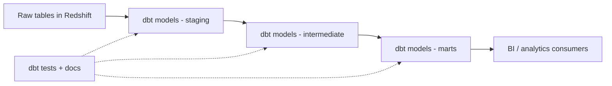

# Manage Data Transformations with dbt in Amazon Redshift
{: .no_toc }

*Part 8: Hands-on Tutorials &middot; Hands-on Tutorials*

**Read the full tutorial:** [Manage Data Transformations with dbt in Amazon Redshift](https://aws.amazon.com/blogs/big-data/manage-data-transformations-with-dbt-in-amazon-redshift/) &#8599;

*Link verified 2026-08-23.*

This tutorial sets up **dbt** against **Redshift**, modeling transformations as version-controlled SQL with tests, documentation, and a DAG of dependent models instead of a tangle of stored procedures.

It's the practical walkthrough behind [The dbt Paradigm: Transformation as Code, Data Contracts & Idempotent Reprocessing](../07-transformation-and-modern-data-stack/02-dbt-paradigm-contracts-idempotency/) — the same warehouse a legacy ETL job used to load nightly now gets its transform logic reviewed, tested, and re-run idempotently like application code.

<!-- prevnext:start -->

---

| [&larr; Previous: Build Your Apache Hudi Data Lake on Amazon EMR](04-lakehouse-hudi-emr/) | [Next: Near-Real-Time Analytics with Redshift Streaming Ingestion & Kinesis &rarr;](06-streaming-analytics-kinesis/) |
|:---|---:|

<!-- prevnext:end -->
