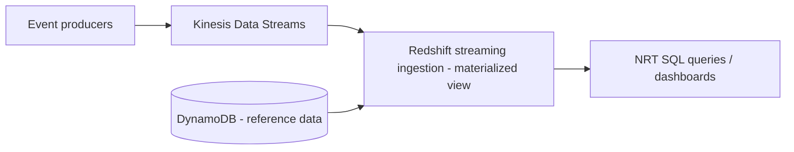

# Near-Real-Time Analytics with Redshift Streaming Ingestion & Kinesis
{: .no_toc }

*Part 8: Hands-on Tutorials &middot; Hands-on Tutorials*

**Read the full tutorial:** [Near-Real-Time Analytics with Redshift Streaming Ingestion & Kinesis](https://aws.amazon.com/blogs/big-data/near-real-time-analytics-using-amazon-redshift-streaming-ingestion-with-amazon-kinesis-data-streams-and-amazon-dynamodb/) &#8599;

*Link verified 2026-08-23.*

This tutorial streams events through **Kinesis Data Streams** directly into **Redshift** using native streaming ingestion — no intermediate S3 landing zone or batch load step — and queries them within seconds of arrival.

It's the concrete version of the latency call in [Should This Be Streaming At All? RT vs NRT Trade-offs & Exactly-Once Semantics](../06-ingestion-and-streaming-decisions/02-should-this-be-streaming-at-all/), and the Kinesis-to-warehouse path it uses is the same shape as the speed layer in [Kappa Architecture: Stream-Only Processing](../02-architecture-patterns-deep-dive/02-kappa-architecture/).

<!-- prevnext:start -->

---

| [&larr; Previous: Manage Data Transformations with dbt in Amazon Redshift](05-elt-dbt-redshift/) | [Next: Data Mesh at Scale with AWS Lake Formation Tag-Based Access Control &rarr;](07-data-mesh-lake-formation-glue/) |
|:---|---:|

<!-- prevnext:end -->
