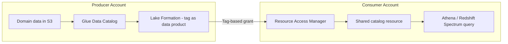

# Data Mesh at Scale with AWS Lake Formation Tag-Based Access Control
{: .no_toc }

*Part 8: Hands-on Tutorials &middot; Hands-on Tutorials*

**Read the full tutorial:** [Data Mesh at Scale with AWS Lake Formation Tag-Based Access Control](https://aws.amazon.com/blogs/big-data/build-a-modern-data-architecture-and-data-mesh-pattern-at-scale-using-aws-lake-formation-tag-based-access-control/) &#8599;

*Link verified 2026-08-23.*

This tutorial uses **Lake Formation**'s tag-based access control to let a producer account publish tables and grant access to consumer accounts by attaching policy tags, rather than naming every resource in every grant.

It's the technical backbone behind two earlier topics: [Data Mesh: Decentralized Domain Ownership](../02-architecture-patterns-deep-dive/05-data-mesh/) and [Data Products & the Data Mesh Operating Model](../11-serving-reliability-and-mesh-operating-model/03-data-products-and-mesh-operating-model/) — domain ownership and federated governance made real as cross-account IAM and catalog permissions.

<!-- prevnext:start -->

---

| [&larr; Previous: Near-Real-Time Analytics with Redshift Streaming Ingestion & Kinesis](06-streaming-analytics-kinesis/) | [Next: Orchestrate an End-to-End ETL Pipeline with S3, Glue, Redshift Serverless & MWAA &rarr;](08-orchestration-managed-airflow-mwaa/) |
|:---|---:|

<!-- prevnext:end -->
