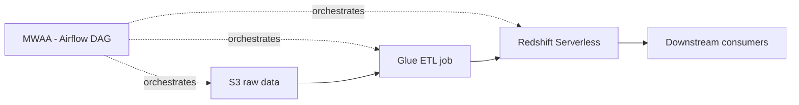

# Orchestrate an End-to-End ETL Pipeline with S3, Glue, Redshift Serverless & MWAA
{: .no_toc }

*Part 8: Hands-on Tutorials &middot; Hands-on Tutorials*

**Read the full tutorial:** [Orchestrate an End-to-End ETL Pipeline with S3, Glue, Redshift Serverless & MWAA](https://aws.amazon.com/blogs/big-data/orchestrate-an-end-to-end-etl-pipeline-using-amazon-s3-aws-glue-and-amazon-redshift-serverless-with-amazon-mwaa/) &#8599;

*Link verified 2026-08-23.*

This tutorial chains an S3-to-Glue-to-Redshift-Serverless pipeline into a single **Airflow** DAG running on **MWAA**, with task dependencies, retries, and scheduling instead of a cron job calling scripts in sequence.

It's the managed-orchestration version of [DataOps & Platform Engineering: CI/CD, IaC/GitOps & Orchestration Patterns](../08-dataops-orchestration-and-metadata/01-dataops-cicd-iac-orchestration/) — the same DAG-and-dependency-management argument that topic makes, expressed as an actual Airflow DAG file.

<!-- prevnext:start -->

---

| [&larr; Previous: Data Mesh at Scale with AWS Lake Formation Tag-Based Access Control](07-data-mesh-lake-formation-glue/) | [Next: Multimodal RAG with Amazon Bedrock Data Automation & Knowledge Bases &rarr;](09-rag-bedrock-vector-store/) |
|:---|---:|

<!-- prevnext:end -->
