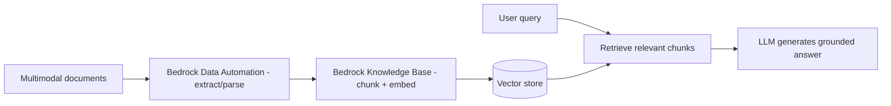

# Multimodal RAG with Amazon Bedrock Data Automation & Knowledge Bases
{: .no_toc }

*Part 8: Hands-on Tutorials &middot; Hands-on Tutorials*

**Read the full tutorial:** [Multimodal RAG with Amazon Bedrock Data Automation & Knowledge Bases](https://aws.amazon.com/blogs/machine-learning/building-a-multimodal-rag-based-application-using-amazon-bedrock-data-automation-and-amazon-bedrock-knowledge-bases/) &#8599;

*Link verified 2026-08-23.*

This tutorial builds a **RAG** pipeline where Bedrock Data Automation extracts text and structure from multimodal documents (PDFs, images), a Bedrock Knowledge Base chunks and embeds them into a vector store, and an LLM answers questions grounded in that retrieved context instead of its training data alone.

It's the working implementation behind [Architecting for AI: Feature Stores, Vector Databases, RAG & Governance Guardrails](../12-architecting-for-ai-and-closing-the-loop/01-architecting-for-ai/) — the same embeddings-and-retrieval architecture, deployed rather than described.

<!-- prevnext:start -->

---

| [&larr; Previous: Orchestrate an End-to-End ETL Pipeline with S3, Glue, Redshift Serverless & MWAA](08-orchestration-managed-airflow-mwaa/) | [Next: AWS Samples: Data Mesh Reference Architecture (DataZone, CDK & CloudFormation) &rarr;](10-aws-samples-data-mesh-reference/) |
|:---|---:|

<!-- prevnext:end -->
