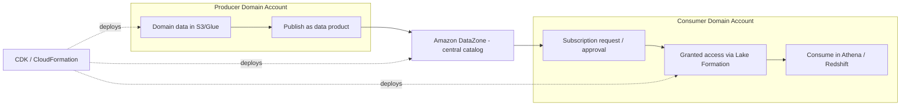

# AWS Samples: Data Mesh Reference Architecture (DataZone, CDK & CloudFormation)
{: .no_toc }

*Part 8: Hands-on Tutorials &middot; Hands-on Tutorials*

**Read the full tutorial:** [AWS Samples: Data Mesh Reference Architecture (DataZone, CDK & CloudFormation)](https://github.com/aws-samples/data-mesh-datazone-cdk-cloudformation) &#8599;

*Link verified 2026-08-23.*

This is a deployable reference repo, not a blog walkthrough: clone it and CDK/CloudFormation stand up a multi-account **data mesh**, with DataZone as the central catalog and subscription workflow connecting producer and consumer domains.

It's the full-stack, infrastructure-as-code companion to [Data Mesh: Decentralized Domain Ownership](../02-architecture-patterns-deep-dive/05-data-mesh/) — worth deploying once to see domain ownership, a central catalog, and self-serve subscription enforced as actual AWS resources rather than a diagram.

<!-- prevnext:start -->

---

| [&larr; Previous: Multimodal RAG with Amazon Bedrock Data Automation & Knowledge Bases](09-rag-bedrock-vector-store/) |  |
|:---|---:|

<!-- prevnext:end -->
