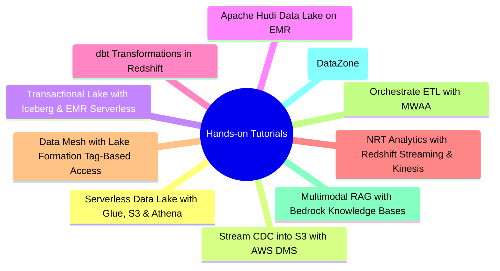

# Hands-on Tutorials
*Part 8: Hands-on Tutorials*

Part 8 comes last because everything before it was building the judgment to know *which* AWS service combination a given problem calls for — this Part hands you ten real, currently-live tutorials to go build with that judgment instead of reading more prose about it. These aren't concept pages: each one is a short pointer to an official AWS walkthrough or reference repo, annotated with what it concretely builds and which earlier concept group it puts into practice.

Taken together, the ten tutorials trace the same layers the rest of the course covered — storage and table formats, ingestion and CDC, transformation, streaming, orchestration, mesh governance, and AI-ready serving — but as deployable infrastructure instead of diagrams. Work through the ones that map to the concepts you're least confident about; there's no required order.

## Tutorials

| # | Tutorial | What it builds |
|---|----------|-----------------|
| 1 | [Serverless Data Lake Analytics with AWS Glue, S3 & Athena](01-serverless-data-lake-glue-athena/) | Build a serverless data lake: crawl S3 with Glue, catalog it, and query it with Athena. |
| 2 | [Stream CDC into an S3 Data Lake in Parquet with AWS DMS](02-cdc-pipelines-dms-redshift/) | Stream ongoing database changes into a lake in Parquet format using AWS Database Migration Service. |
| 3 | [Transactional Data Lake with Apache Iceberg, EMR Serverless & Athena](03-transactional-lake-iceberg-glue-athena/) | Add ACID transactions, schema evolution, and time travel to an S3 data lake with Iceberg. |
| 4 | [Build Your Apache Hudi Data Lake on Amazon EMR](04-lakehouse-hudi-emr/) | Run upserts and incremental pulls against a lakehouse table using Hudi on EMR. |
| 5 | [Manage Data Transformations with dbt in Amazon Redshift](05-elt-dbt-redshift/) | Model and transform warehouse data as version-controlled SQL using dbt against Redshift. |
| 6 | [Near-Real-Time Analytics with Redshift Streaming Ingestion & Kinesis](06-streaming-analytics-kinesis/) | Ingest and analyze a live event stream directly into Redshift via Kinesis Data Streams. |
| 7 | [Data Mesh at Scale with AWS Lake Formation Tag-Based Access Control](07-data-mesh-lake-formation-glue/) | Share and govern data products across accounts/domains using Lake Formation's data-mesh pattern. |
| 8 | [Orchestrate an End-to-End ETL Pipeline with S3, Glue, Redshift Serverless & MWAA](08-orchestration-managed-airflow-mwaa/) | Schedule and monitor a multi-step pipeline as a DAG using managed Airflow (MWAA). |
| 9 | [Multimodal RAG with Amazon Bedrock Data Automation & Knowledge Bases](09-rag-bedrock-vector-store/) | Ground an LLM's answers in your own documents using Bedrock Knowledge Bases and a vector store. |
| 10 | [AWS Samples: Data Mesh Reference Architecture (DataZone, CDK & CloudFormation)](10-aws-samples-data-mesh-reference/) | A deployable reference implementation of a data-mesh architecture on AWS, straight from AWS's official samples org. |

<!-- prevnext:start -->

---

| [&larr; Previous: Capstone: Designing and Defending an AI-Ready Platform to the Board](../12-architecting-for-ai-and-closing-the-loop/03-capstone-designing-and-defending-ai-ready-platform/) | [Next: Serverless Data Lake Analytics with AWS Glue, S3 & Athena &rarr;](01-serverless-data-lake-glue-athena/) |
|:---|---:|

<!-- prevnext:end -->
