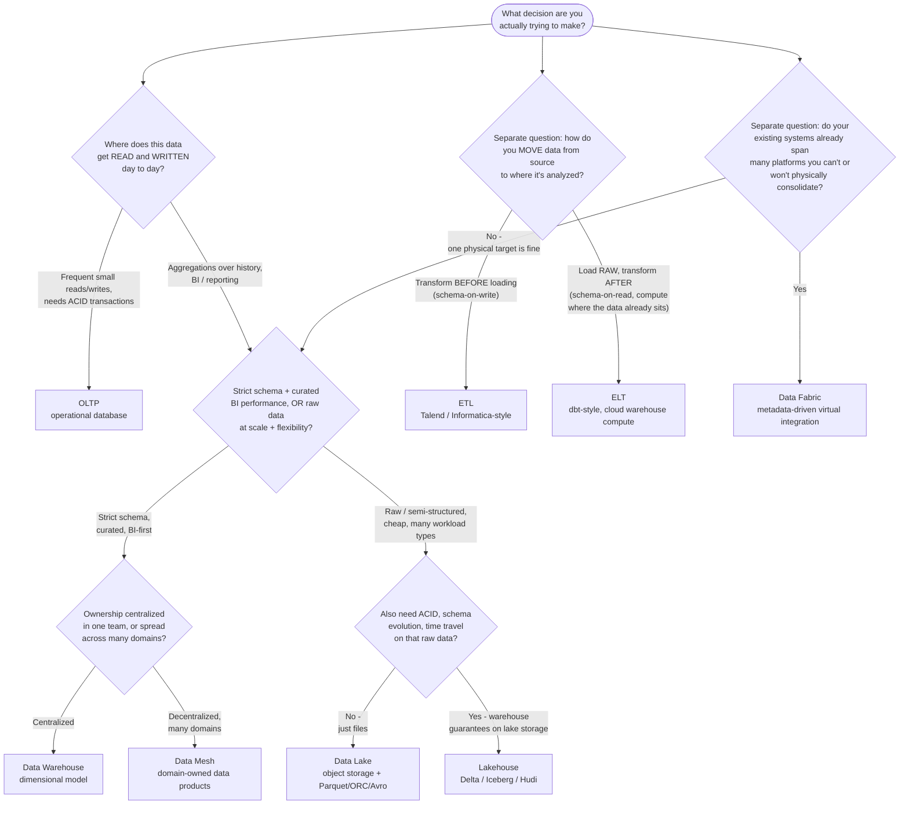

# Data Architecture: A Field Guide for Data Engineers
{: .fs-9 }

A practical, self-contained guide to modern data architecture for data engineers coming from
legacy warehouses, SQL, and ETL tools like Talend.
{: .fs-6 .fw-300 }

If you've spent years writing SQL against a warehouse and building ETL jobs in tools like Talend
or Informatica, you already understand data at the level that matters most — you just haven't had
to *decide* the shape of the whole system yet. That's what this guide is for: it takes what you
already know and builds outward from it, group by group, toward the decisions a data architect
actually has to make and defend.

## How this guide is organized

- Each **group** below covers a related cluster of topics and opens with a mind map so you can see
  how its pieces relate before reading any of them in depth.
- Individual **topics** use diagrams only where a picture genuinely clarifies a process or
  trade-off — otherwise you'll find tables, code blocks, or plain explanation.
- **Hands-on Tutorials** (the last group) links out to real, working AWS tutorials and sample
  repos, each paired with a diagram of what it builds — read the concepts here, then go build them.
- Every page has a **Previous / Next** link at the bottom so you can read straight through, and the
  sidebar on the left gives you the full map at any point.

## The Arc

This isn't a stack of unrelated topics — it's one argument, in eight parts. Each part exists
because the one before it created a question the next one answers.

**Part 1 — Theory & Foundations.** Before any architecture decision makes sense, you need the
physics underneath it: ACID, BASE, and the CAP theorem, why OLTP and OLAP are different problems,
and how your existing warehouse/SQL/Talend experience maps onto the vocabulary this guide uses.

**Part 2 — The Architecture Landscape.** With the theory in hand, see the shapes architectures
actually take (Lambda, Kappa, Lakehouse, Medallion, Mesh, Fabric), then learn the decision
framework — requirements, constraints, build vs buy vs compose — for choosing among them.

**Part 3 — Designing the Data Layer.** The two things every architecture sits on: how you store
data (object storage, table formats, consistency guarantees) and how you model it (warehouse
design philosophy, dimensional modeling, alternatives to the star schema).

**Part 4 — Moving & Shaping Data.** Once the data layer is designed, data has to get in and get
transformed: ingestion strategy, whether to stream at all, and the ELT/medallion/dbt transformation
stack.

**Part 5 — Running It Like a Platform.** A pipeline is not a platform. This is what turns one into
the other: DataOps and orchestration, data quality and master data management, security and
governance, and the cost/performance economics that make it sustainable.

**Part 6 — Delivering Value & Staying Up.** The platform has to actually serve consumers (BI,
APIs, reverse ETL) and stay reliable (SLAs, DR, the mesh operating model) or none of the above
mattered.

**Part 7 — The Frontier & the Defense.** Architecting for AI workloads, then the discipline of
recording *why* you decided what you decided (ADRs, anti-patterns, war stories) — capped by a
capstone where you design and defend a full architecture to a board.

**Part 8 — Hands-on Tutorials.** Real, verified AWS tutorials and sample repos, each mapped back to
the concept group it puts into practice.

## Not Sure Where to Start? A Master Decision Map

Storage, databases, ETL/ELT, and warehouse-vs-lake-vs-lakehouse all get taught as separate topics
below, but in practice they're three *separate* decisions that get tangled together when someone
says "what architecture should we use?" This map splits them back apart. Follow whichever branch
matches the question you're actually asking, then use the "Jump to the deep dive" table underneath
to go straight to the topic that covers it in depth.

**Jump to the deep dive:**

| Leaf on the map | Read this |
|---|---|
| OLTP | [OLTP vs OLAP](01-foundations/03-oltp-vs-olap/) |
| Data Warehouse | [The Evolution of Data Architecture](03-architects-decision-framework/02-evolution-of-data-architecture/) &middot; [Dimensional Modeling for the Cloud Era](05-dimensional-modeling-cloud-era/) |
| Data Lake | [Storage Foundations](04-storage-and-table-formats/01-storage-foundations/) |
| Lakehouse | [Lakehouse Architecture](02-architecture-patterns-deep-dive/03-lakehouse-architecture/) &middot; [Table Formats: Delta vs Iceberg vs Hudi](04-storage-and-table-formats/02-table-formats-delta-iceberg-hudi/) |
| Data Mesh | [Data Mesh: Decentralized Domain Ownership](02-architecture-patterns-deep-dive/05-data-mesh/) |
| Data Fabric | [Data Fabric: Metadata-Driven Integration](02-architecture-patterns-deep-dive/06-data-fabric/) |
| ETL vs ELT | [From Legacy ETL to Modern ELT](01-foundations/05-legacy-etl-to-modern-elt/) &middot; [ETL vs ELT & the Medallion Pattern in Practice](07-transformation-and-modern-data-stack/01-etl-vs-elt-and-medallion-in-practice/) |
| All 6 patterns compared side by side | [Choosing Among the Patterns](02-architecture-patterns-deep-dive/07-choosing-among-five-patterns/) &middot; [A Mental Model for Architecture Choices](03-architects-decision-framework/04-mental-model-for-architecture-choices/) |

## Groups

| # | Part | Group | Topics |
|---|------|-------|--------|
| 1 | 1 | [Foundations: Bridging from Legacy DW & ETL](01-foundations/) | 9 |
| 2 | 2 | [Architecture Patterns Deep Dive](02-architecture-patterns-deep-dive/) | 7 |
| 3 | 2 | [The Architect's Decision Framework](03-architects-decision-framework/) | 4 |
| 4 | 3 | [Storage & Table Formats](04-storage-and-table-formats/) | 3 |
| 5 | 3 | [Dimensional Modeling for the Cloud Era](05-dimensional-modeling-cloud-era/) | 4 |
| 6 | 4 | [Ingestion & Streaming Decisions](06-ingestion-and-streaming-decisions/) | 2 |
| 7 | 4 | [Transformation & the Modern Data Stack](07-transformation-and-modern-data-stack/) | 2 |
| 8 | 5 | [DataOps, Orchestration & Metadata](08-dataops-orchestration-and-metadata/) | 2 |
| 9 | 5 | [Quality, Security & Governance](09-quality-security-and-governance/) | 3 |
| 10 | 5 | [Cost & Performance Architecture](10-cost-and-performance-architecture/) | 2 |
| 11 | 6 | [Serving, Reliability & the Mesh Operating Model](11-serving-reliability-and-mesh-operating-model/) | 3 |
| 12 | 7 | [Architecting for AI & Closing the Loop](12-architecting-for-ai-and-closing-the-loop/) | 3 |
| 13 | 8 | [Hands-on Tutorials](13-hands-on-tutorials/) | 10 |

<!-- prevnext:start -->

---

|  | [Next: Foundations: Bridging from Legacy DW & ETL &rarr;](01-foundations/) |
|:---|---:|

<!-- prevnext:end -->
